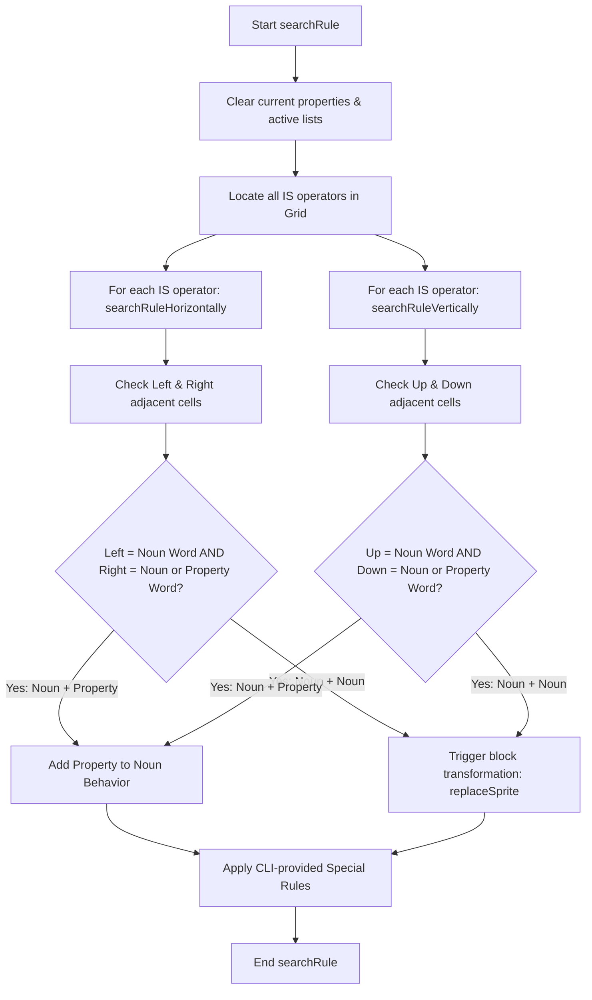

# Developer Manual - Baba Is You Java Implementation

This document serves as the technical reference manual for engineers, systems designers, and technical editors working on the Java implementation of *Baba Is You*. It details the setup process, directory layout, architectural design, component responsibilities, core state transition algorithms, and coding standards of the codebase.

---

## Table of Contents

1. [Project Overview](#1-project-overview)
   - [Target Framework and Platform](#target-framework-and-platform)
   - [External Dependencies](#external-dependencies)
   - [Repository Layout](#repository-layout)
2. [Environment Setup & Build System](#2-environment-setup--build-system)
   - [System Prerequisites](#system-prerequisites)
   - [Compilation and Packaging via Apache Ant](#compilation-and-packaging-via-apache-ant)
3. [Architecture & Core Subsystems](#3-architecture--core-subsystems)
   - [Architectural Pattern](#architectural-pattern)
   - [Detailed Package Breakdown](#detailed-package-breakdown)
4. [Core Execution & Processing Logic](#4-core-execution--processing-logic)
   - [Rule Parsing & Evaluation Phase](#rule-parsing--evaluation-phase)
   - [Recursive Movement & Collision System](#recursive-movement--collision-system)
   - [State History & Undo Queue](#state-history--undo-queue)
5. [Asset & Pipeline Guidelines](#5-asset--pipeline-guidelines)
   - [Directory Structure](#directory-structure)
   - [Adding Custom Sprites & Textures](#adding-custom-sprites--textures)
6. [Coding Standards](#6-coding-standards)

---

## 1. Project Overview

This project is a grid-based puzzle game implemented in Java, replicating the core rules and mechanics of the award-winning game *Baba Is You*. In this game, rules are physical blocks placed within the grid itself. By pushing and manipulating these word blocks, players change how the game behaves, redefining objects (e.g., making a wall pushable, turning lava into water, or redefining the player character).

### Target Framework and Platform
* **Programming Language:** Java 21+ (utilizing modern features such as Records, Sealed Interfaces, Pattern Matching for switch blocks, and Streams).
* **Target Platforms:** Windows, macOS, Linux (any desktop OS with a compatible Java Runtime Environment).
* **Graphics & Application Frame Library:** `com.github.forax.zen` (Zen framework version 6.0), which provides a simple, hardware-accelerated Swing-based graphics context, window frame initialization, and event polling loop.

### External Dependencies
* **Zen Framework Library:** `lib/zen-6.0.jar` (facilitates the application window lifecycle, keyboard and pointer event collection, and frame rendering).
* **Java Standard Library:** Standard AWT and Swing rendering packages (`java.awt.*`, `javax.swing.*`), NIO for file system interaction, and standard collections frameworks.

### Repository Layout

The workspace is organized as follows:

```
Baba-is-you/
├── lib/                        # Third-party jar archives
│   └── zen-6.0.jar             # Zen graphic framework library
├── src/                        # Main source tree
│   ├── baba/                   # Root Java package
│   │   ├── config/             # Configuration, command-line parsing, and level generation
│   │   ├── engine/             # Main game loop, runtime controllers, and window bindings
│   │   ├── grid/               # Grid data structures, behavior matrices, and physics rules
│   │   ├── names/              # Rule objects, word/operator/property semantics
│   │   └── view/               # Graphic rendering pipeline and image loader
│   ├── images/                 # Resource directory containing block/text sprites
│   │   ├── blocks/             # Sprites for concrete physical blocks (e.g. baba.gif, wall.gif)
│   │   └── texts/              # Sprites for text words (blocks, operators, properties)
│   └── levels/                 # Game level database (.txt files)
│       ├── default/            # Standard level files
│       ├── exclusive/          # Tailored levels with custom configurations
│       └── original/           # Levels modeled after the original commercial release
└── build.xml                   # Apache Ant configuration file
```

---

## 2. Environment Setup & Build System

### System Prerequisites
To build and run the project, the system must have:
* **Java Development Kit (JDK):** JDK 21 or higher. Ensure that the `JAVA_HOME` environment variable points to your JDK directory and that the `java` and `javac` commands are available in your system path.
* **Apache Ant:** Command-line build tool. Ensure that the `ant` executable is available in your system path.

### Compilation and Packaging via Apache Ant

The project uses Apache Ant to automate building, packaging, and documenting. The configuration is defined in [build.xml](../build.xml).

#### Key Build Targets
To run these targets, execute the commands from the repository root:

* **Compile Source Files:**
  ```cmd
  ant compile
  ```
  Compiles all source files in `src/` and outputs the resulting bytecode `.class` files into a transient `classes/` directory.

* **Build Runnable JAR:**
  ```cmd
  ant jar
  ```
  Compiles the codebase and packages it into `baba.jar` in the root directory. The JAR file's manifest is configured to reference `baba.engine.Main` as the entry point and includes `lib/zen-6.0.jar` in its classpath.

* **Generate API Documentation:**
  ```cmd
  ant javadoc
  ```
  Generates standard HTML Javadoc files for all source classes and places them in `docs/doc/`.

* **Clean Workspace:**
  ```cmd
  ant clean
  ```
  Deletes all generated class and jar files.

---

## 3. Architecture & Core Subsystems

### Architectural Pattern

The application utilizes a variation of the Model-View-Controller (MVC) pattern:
1. **Model (State Representation):** Managed by the `baba.grid` package (specifically [Grid.java](../src/baba/grid/Grid.java) and [Item.java](../src/baba/grid/Item.java)). It holds the state of the active board, where items are located, and the current active rules.
2. **View (Rendering Subsystem):** Managed by [View.java](../src/baba/view/View.java), which handles coordinates-to-pixels translation, scales graphics according to window constraints, and paints sprites using standard Java 2D Graphics APIs.
3. **Controller (Application & Input Loop):** Managed by [Controller.java](../src/baba/engine/Controller.java), which initializes the Zen graphic frame, catches user keyboard inputs, sequences logic ticks (evaluating rules, checking collisions, triggering victory conditions), and requests frame redraws.

---

### Detailed Package Breakdown

#### Package: `baba.config`
Handles initial program execution command arguments, loading configuration parameters, parsing level definitions, and instantiating game items.
* **[CommandParser.java](../src/baba/config/CommandParser.java):** Parses CLI flags (`--levels`, `--level`, and `--execute`). It processes pre-executed starting rules (e.g. `t_baba is you`) and translates them into semantic records.
* **[Config.java](../src/baba/config/Config.java):** A record representing the immutable configuration of the window width, height, target level path, grid boundaries (rows and columns), background color, and CLI-specified starting rules.
* **[Factory.java](../src/baba/config/Factory.java):** Contains helper factory methods to instantiate game items. In particular, it contains the `putAndLink` method, which is used to draw contiguous lines of blocks (like walls) using sequential start and end coordinates.
* **[Flags.java](../src/baba/config/Flags.java):** Defines execution flags (`levels`, `level`, `execute`) as a Java enum.
* **[GameSetter.java](../src/baba/config/GameSetter.java):** Coordinates level progression, transitions to subsequent level index files, and acts as a global configurations manager during execution setup.
* **[LevelParser.java](../src/baba/config/LevelParser.java):** Reads text-based level files, extracts parameters, and loads tiles.
* **[Modes.java](../src/baba/config/Modes.java):** Enum reflecting parsing sections in level text files (`ROWS`, `COLUMNS`, `BLOCKS`, `WORDS`).

#### Package: `baba.engine`
Responsible for the runtime application execution lifecycle.
* **[Main.java](../src/baba/engine/Main.java):** Entry point of the program. It sets up the config and loops through Controller instances until the user exits or wins all levels.
* **[Controller.java](../src/baba/engine/Controller.java):** Manages the central loop via the Zen framework. Polling is executed at fixed cycles. It catches keyboard events, calls grid transitions, triggers collision phases, and draws the output to the window.

#### Package: `baba.grid`
Models the physical board components, item properties, physics boundaries, and transaction histories.
* **[Item.java](../src/baba/grid/Item.java):** A sealed interface permitting `Block` and `Word`. It defines common behavior for items: retrieving images, checking positions, and translating in space via direction vectors.
* **[Tile.java](../src/baba/grid/Tile.java):** An immutable representation of a grid cell defined by coordinate indices `(row, column)`. Includes boundary checking and neighbor calculations.
* **[Block.java](../src/baba/grid/Block.java):** Represents a physical non-word entity on the board (e.g.  Baba, a flag, grass, water).
* **[Word.java](../src/baba/grid/Word.java):** Represents a text block placed on the board (e.g. , , ).
* **[Grid.java](../src/baba/grid/Grid.java):** The primary model component. It maintains a mapping of tiles to lists of items, dynamic behavioral maps, active rules, push hierarchies, rule parsing, and movement simulation.
* **[Behavior.java](../src/baba/grid/Behavior.java):** Represents the dynamically assigned physical capabilities of a specific object name (e.g., whether it is pushable, deadly, or controllable).
* **[Direction.java](../src/baba/grid/Direction.java):** Enum specifying vectors (`UP`, `DOWN`, `LEFT`, `RIGHT`).
* **[AtomicMove.java](../src/baba/grid/AtomicMove.java):** Tracks a single unit movement or transform state of a block. Used to reconstruct past frames in the undo stack.

#### Package: `baba.names`
Represents the semantic symbols parsed from level files and active rule structures.
* **[SpriteName.java](../src/baba/names/SpriteName.java):** Core sealed interface for all text and block words. Permitted sub-interfaces are `BlockName` and `WordName`.
* **[WordName.java](../src/baba/names/WordName.java):** Sealed interface identifying names representing words. Permitted subclasses are `BlockWord`, `OperatorWord`, and `PropertyWord`.
* **[BlockName.java](../src/baba/names/BlockName.java):** Enum mapping physical block identities.
* **[BlockWord.java](../src/baba/names/BlockWord.java):** Enum mapping the noun text blocks (e.g. `T_BABA`, `T_WALL`).
* **[OperatorWord.java](../src/baba/names/OperatorWord.java):** Enum representing operator words, currently containing only `IS`.
* **[PropertyWord.java](../src/baba/names/PropertyWord.java):** Enum representing descriptive characteristics that can be assigned (`YOU`, `WIN`, `STOP`, `PUSH`, `SINK`, `DEFEAT`, `MELT`, `HOT`, `STICK`).
* **[Rule.java](../src/baba/names/Rule.java):** Sealed interface defining standard rule types. Permitted types are `BlockRule`, `PropRule`, and `EmptyRule`.

#### Package: `baba.view`
Manages graphic context drawing.
* **[ImageLoader.java](../src/baba/view/ImageLoader.java):** A helper class that loads files from `src/images/` using AWT `ImageIcon`.
* **[View.java](../src/baba/view/View.java):** Calculates screen scaling dynamically based on target window resolution, clears frames, translates coordinates, and renders items on the screen.

---

## 4. Core Execution & Processing Logic

### Rule Parsing & Evaluation Phase

Every tick of the game loop triggers a search for rules formed on the grid. Rule parsing is performed inside the `searchRule()` method of `Grid.java` as follows:



#### Rule Definitions
* **Property Assignment Rules:** If the structure matches `[Noun Block] IS [Property Word]`, the property is assigned to the Behavior associated with that noun block (e.g.   ).
* **Block Transformation Rules:** If the structure matches `[Noun Block 1] IS [Noun Block 2]`, all existing items belonging to Noun 1 are replaced with items of type Noun 2 at their exact coordinates (e.g.   ).

---

### Recursive Movement & Collision System

When a player inputs a direction key, the movement solver checks if the translation can proceed. This is executed in `pushRecursively(Tile tile, Direction direction)` within [Grid.java](../src/baba/grid/Grid.java):

1. **Evaluate Target Tile:** Inspect all items situated on the target coordinate.
2. **Examine Constraints:**
   - If any item on the tile is defined as `STICK`, movement is checked.
   - If any item on the tile has the property `STOP` (and does not also have the property `YOU`), movement is blocked.
   - If the tile touches the outer layout boundary, movement is blocked.
3. **Recursive Push Pipeline:**
   - If the items on the target tile have the property `PUSH` (or are word blocks, which are pushable by default), the method recursively calls `pushRecursively` on the next adjacent tile in the movement direction.
   - If the adjacent cell returns `true`, the current items are shifted.
   - If the adjacent cell returns `false`, the movement path is blocked, and no items shift.

#### Collision Phase
After the movement is completed, the game evaluates specific property rules:
* **`SINK`:** If multiple items share a tile and one has the property `SINK`, both items are destroyed and removed from the board.
* **`DEFEAT`:** If an item with `YOU` shares a tile with an item with `DEFEAT`, the `YOU` item is destroyed.
* **`HOT` & `MELT`:** If an item with `MELT` shares a tile with an item with `HOT`, the `MELT` item is destroyed.
* **`WIN`:** If an item with `YOU` shares a tile with an item with `WIN`, the level is won.

---

### State History & Undo Queue

The undo system is built using a transaction log pattern:
* **Moves Deque:** `Grid.java` maintains a `moves` stack of type `Deque<List<AtomicMove>>`.
* **Action Logs:** As items move or transform during a player action, instances of `AtomicMove` (storing the original item state and the target item state) are recorded in the `atomics` array list.
* **Save Snapshot:** When a movement turns out valid and gets saved, the current list of atomic operations is pushed onto the `moves` deque.
* **Undo Trigger:** When the user presses the `SPACE` key, `undoMove()` pops the last list of atomic moves off the deque and reverts each item back to its previous state and position.

---

## 5. Asset & Pipeline Guidelines

### Directory Structure
Sprites must reside within `src/images/`.
* **Concrete Sprites:** Placed in `src/images/blocks/` and named `[lowercase_blockname].gif` (e.g. `baba.gif`, `wall.gif`).
* **Text Sprites:** Placed in `src/images/texts/`:
  - Nouns: `texts/blocks/[lowercase_blockword].gif` (e.g., `texts/blocks/t_baba.gif`).
  - Operators: `texts/operators/[lowercase_operatorword].gif` (e.g., `texts/operators/is.gif`).
  - Properties: `texts/properties/[lowercase_propertyword].gif` (e.g., `texts/properties/you.gif`).

### Adding Custom Sprites & Textures
To add a new object to the game:
1. Save a `.gif` sprite in `src/images/blocks/`.
2. Save a corresponding text sprite in `src/images/texts/blocks/`.
3. Add the noun enum value to `BlockName.java` and `BlockWord.java`.
4. Update `BlockWord.blockName()` to map the text to the physical block name.
5. Compile and rebuild the project.

---

## 6. Coding Standards

* **Java Language Compliance:** The codebase must target Java 21+. Use records for immutable configurations or data-only classes, and use modern switch expressions where appropriate.
* **Comments and Javadocs:** Write Javadocs for all public classes, records, and methods. Explain the parameters, return types, and potential exceptions.
* **Immutability:** Use records or make class attributes `private final` unless mutability is explicitly required for class states (such as the main item mapping).
