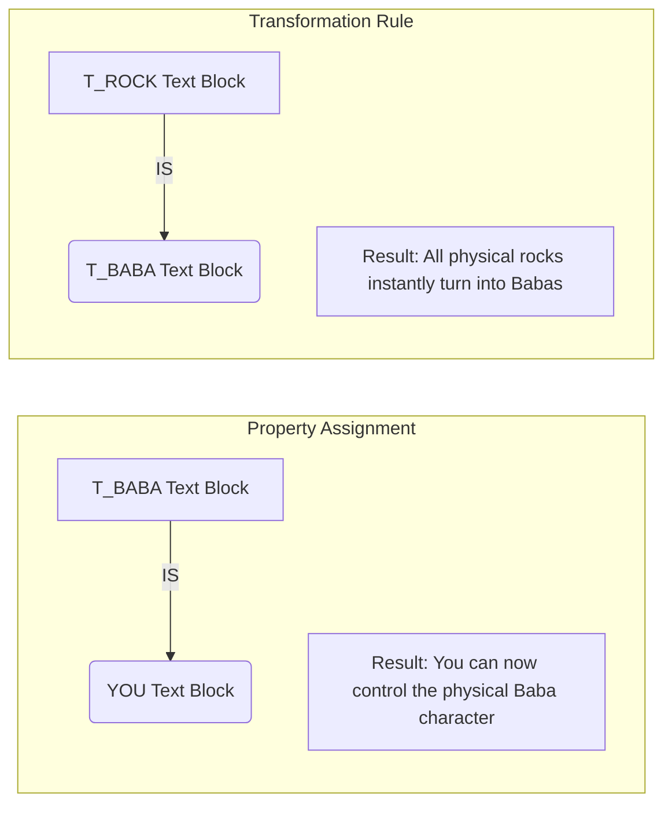

# User Manual - Baba Is You Java Implementation

Welcome to the player and creator manual for *Baba Is You*. This guide will explain how to install, configure, and play the game, as well as how to design your own custom levels.

---

## Table of Contents

1. [Introduction](#1-introduction)
   - [Game Concept](#game-concept)
   - [System Requirements](#system-requirements)
2. [Installation & Execution](#2-installation--execution)
   - [Executing the JAR Archive](#executing-the-jar-archive)
   - [Command-Line Argument Specifications](#command-line-argument-specifications)
3. [Controls & Inputs](#3-controls--inputs)
4. [Gameplay Mechanics & Rules](#4-gameplay-mechanics--rules)
   - [How Rules Work](#how-rules-work)
   - [Word Categories](#word-categories)
   - [Property Behaviors Matrix](#property-behaviors-matrix)
   - [Special Glue & Stick Mechanics](#special-glue--stick-mechanics)
   - [Undo and Rewind Mechanics](#undo-and-rewind-mechanics)
5. [Custom Level Design Guide](#5-custom-level-design-guide)
   - [Level File Format Structure](#level-file-format-structure)
   - [Block Layout Syntax](#block-layout-syntax)
   - [Step-by-Step Level Customization](#step-by-step-level-customization)
6. [Troubleshooting & Support](#6-troubleshooting--support)

---

## 1. Introduction

### Game Concept
*Baba Is You* is a puzzle game where the rules you must follow are present as physical blocks you can interact with. By pushing and aligning these blocks, you can alter how the level itself operates. Turn yourself into a rock, make walls pushable, float over water, or change the victory condition entirely. If a rule can be formed in the grid, it becomes law.

### System Requirements
* **Operating System:** Windows 10/11, macOS (10.15+), or Linux distributions.
* **Java Runtime:** Java Runtime Environment (JRE) version 21 or higher installed on the system.
* **Graphics:** Monitor supporting minimum resolution of 1024x768.

---

## 2. Installation & Execution

### Executing the JAR Archive
Ensure your JDK/JRE is installed and mapped in your terminal paths. Download or compile the `baba.jar` file and place it in the root folder of the project repository containing the `src/` directory.

To run the game, open a terminal window in the project folder and launch it using:
```cmd
java -jar baba.jar
```

---

### Command-Line Argument Specifications

You can configure the starting level, the level packs, and starting rules by providing parameters on launch.

#### Available Flags
* **`--levels [folder_name]`**
  Specifies which level folder directory to load.
  * Options: `default`, `exclusive`, `original`
* **`--level [level_number]`**
  Loads the specified level number.
  * Options: `1` (for `exclusive`), `1` to `6` (for `original` and `default`)
* **`--execute [noun_word] [operator] [property/noun]`**
  Injects a custom starting rule when the level boots. This is highly useful for testing or introducing starting conditions.
  * **Syntax:** Nouns must be prefixed with `t_` (e.g., `t_baba`, `t_rock`, `t_wall`, `t_glue`). Operators must be `is`. Properties must be lower-case identifiers (e.g., `you`, `win`, `push`, `stop`, `sink`, `defeat`, `melt`, `hot`, `stick`).

#### Example Command Line Operations
* **Run Level 1 from the Exclusive Set:**
  ```cmd
  java -jar baba.jar --levels exclusive --level 1
  ```
* **Run Default Level 2 with starting rule "Baba Is Rock":**
  ```cmd
  java -jar baba.jar --levels default --level 2 --execute t_baba is t_rock
  ```
* **Run Original Level 3 with starting rule "Rock Is You":**
  ```cmd
  java -jar baba.jar --levels original --level 3 --execute t_rock is you
  ```

---

## 3. Controls & Inputs

The game is controlled entirely via the keyboard.

| Input Key | Action / Function |
| :--- | :--- |
| **Arrow Up** ($\uparrow$) | Move controllable items (`YOU`) Up by 1 grid tile |
| **Arrow Down** ($\downarrow$) | Move controllable items (`YOU`) Down by 1 grid tile |
| **Arrow Left** ($\leftarrow$) | Move controllable items (`YOU`) Left by 1 grid tile |
| **Arrow Right** ($\rightarrow$) | Move controllable items (`YOU`) Right by 1 grid tile |
| **Spacebar** | Undo / Rewind the last action back by one move |
| **Q** or **Escape** | Quit the current level execution and close the window |

---

## 4. Gameplay Mechanics & Rules

### How Rules Work
Rules are active only when three matching text blocks are aligned horizontally (left-to-right) or vertically (top-to-bottom) forming a valid rule sequence: `[Noun] IS [Property]` or `[Noun 1] IS [Noun 2]`. 



* If blocks are pushed apart, the rule immediately breaks.
* If a new sequence is created, the rule takes effect instantly.

---

### Word Categories

There are three categories of text blocks in the game:

1. **Noun Words:** Identify the target block type.
   *  (`T_BABA`) refers to 
   *  (`T_FLAG`) refers to 
   *  (`T_ROCK`) refers to 
   *  (`T_WALL`) refers to 

2. **Operator Words:** Connects nouns to behaviors or other nouns.
   *  (`IS`)

3. **Property Words:** Assigns physical traits or behaviors to the target blocks. (e.g.,  or ).

---

### Property Behaviors Matrix

| Property Block | Behavior Description |
| :---: | :--- |
|  | Designates the object you control. Pressing direction keys translates all active instances of this object. |
|  | Designates the victory target. If a `YOU` item occupies the same cell as a `WIN` item, you win and progress. |
|  | Prevents movement. Items cannot pass through or enter a cell occupied by a `STOP` item. |
|  | Allows you to push the item. When walked into, the block shifts forward in the direction of movement. |
|  | Destroys items sharing the tile. If any item walks onto a `SINK` block, both items are deleted. |
|  | Deadly block. If a controllable `YOU` item touches a `DEFEAT` block, the `YOU` item is destroyed. |
|  | Emits intense heat. Destroy any `MELT` items occupying the same tile. |
|  | Vulnerable to heat. Instantly destroyed if sharing a tile with a `HOT` item. |
|  | Sticky behavior. Locks movement transitions. (See details below). |

---

### Special Glue & Stick Mechanics
* **`GLUE` Noun:** Represents physical slime patches ().
* **`STICK` Property:** When a rule is formed (e.g.   ), any item that steps onto a `GLUE` cell gets stuck.
* **Movement Constraint:** Once your controlled character steps onto a cell containing a `STICK` item, all direction moves in any direction are blocked. You must press **Spacebar** to undo your movement and free yourself.

---

### Undo and Rewind Mechanics
If you make a mistake, push a block against a wall, or get your character destroyed, you do not need to restart the level. Pressing the **Spacebar** reverts the game back to the previous turn. You can hold or press spacebar repeatedly to undo actions all the way back to the start of the level. The game remembers everything you did perfectly!

---

## 5. Custom Level Design Guide

Levels are saved as standard text `.txt` files inside the `src/levels/` directory.

### Level File Format Structure
A level file consists of four configuration headers:

```
rows
[number_of_rows]

columns
[number_of_columns]

blocks
[block_name]: [layout_specifiers]

words
[word_name]: [coordinates]
```

---

### Block Layout Syntax
When defining coordinates for blocks or words, you specify row and column indices (1-indexed, starting from top-left):

1. **Separated Blocks (`{ ... }`):** Inserts individual blocks at specific row and column pairs.
   * *Syntax:* `name: {row1 col1  row2 col2}`
   * *Example:* `baba: {12 17  11 16}` places Baba blocks at (12, 17) and (11, 16).
2. **Linked Blocks (`[ ... ]`):** Generates lines of contiguous blocks connecting the points.
   * *Syntax:* `name: [row1 col1  row2 col2]`
   * *Example:* `wall: [1 1  1 28]` draws a wall from row 1 column 1 to row 1 column 28.

---

### Step-by-Step Level Customization

Here is an example level definition file. To create a level:
1. Create `src/levels/default/7.txt`.
2. Populate it with the configuration below:

```text
rows
10

columns
10

blocks
wall: [1 1  1 10], [1 10  10 10], [10 1  10 10], [1 1  10 1]
baba: {5 3}
flag: {5 8}

words
t_baba: 3 3
is: 3 4  7 4
you: 3 5
t_flag: 7 3
win: 7 5
```

3. Save the file and execute it:
   ```cmd
   java -jar baba.jar --levels default --level 7
   ```

---

## 6. Troubleshooting & Support

### Missing Resource Error / Black Window
* **Symptom:** The game screen loads but is completely black or exits with a `NullPointerException` in `ImageLoader`.
* **Reason:** The program looks for the `src/images/` directory relative to the current working directory (`user.dir`).
* **Fix:** Ensure you launch the terminal from the **root folder** of the project repository (where the `src` folder resides) and execute the JAR from there:
  ```cmd
  java -jar baba.jar
  ```

### File Not Found Error
* **Symptom:** Terminal outputs `"Selected level folder or level X.txt does not exist"`.
* **Fix:** Double check that your folder name is spelt correctly (e.g. `default`, `exclusive`, `original`) and that the level number file exists (e.g. `1.txt`).
